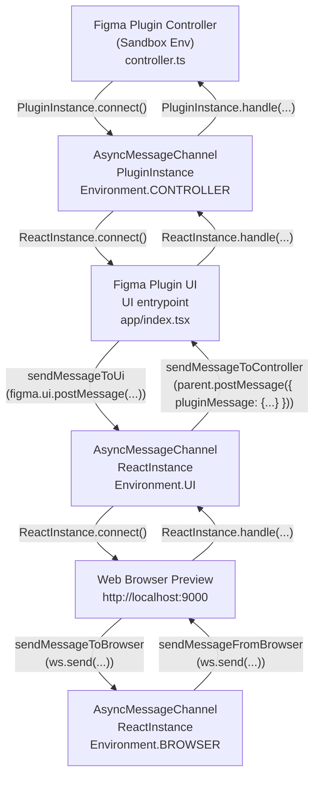

# AsyncMessageChannel

## `AsyncMessageChannel` Data Flow



## Instances

Static instances of `AsyncMessageChannel` are initialised when the class is loaded:

- `PluginInstance` - used from inside of `controller` entrypoint
- `ReactInstance` - used from inside of `ui` entrypoint

```ts
class AsyncMessageChannel {
  public static PluginInstance: AsyncMessageChannel = new AsyncMessageChannel(true);
  public static ReactInstance: AsyncMessageChannel = new AsyncMessageChannel(false);

  protected inFigmaSandbox = false;

  constructor(inFigmaSandbox: boolean) {
    this.inFigmaSandbox = inFigmaSandbox
  }
}

```

- 

## Environments

There are currently three environments:

```ts
enum Environment {
  PLUGIN = 'PLUGIN',
  UI = 'UI',
  BROWSER = 'BROWSER',
```

- `Environment.PLUGIN` – `controller` entrypoint
- `Environment.UI` – `ui` entrypoint
  - Has access to `parent.postMessage`
- `Environment.BROWSER` – `ui` entrypoint
  - Need to use WebSockets to send messages to the plugin `ui`

## Lifecycle

**`.connect()`**

Example: `AsyncMessageChannel.PluginInstance.connect();` or `AsyncMessageChannel.ReactInstance.connect();`

If in a web preview environment (`Environment.BROWSER` or `Environment.UI`), a WebSocket client listener is registered here (`this.startWebSocketConnection();`)

Registers message listeners with `this.attachMessageListener(callback)`, where `callback` in this case is [`this.onMessageEvent`](#onmessageeventmsg)

**`.attachMessageListener(callback)`**

Conditionally registers message event handlers depending on the environment:

- `Environment.CONTROLLER`
  - `figma.ui.on('message', listener)`
- `Environment.UI`
  - `window.addEventListener('message', listener)` – listens to messages controller
    - *IF process.env.PREVIEW_MODE IS SET*
      - `this.ws?.addEventListener('message', listener)`
      - Where if this condition is true, `UI` has two message listeners, one to listen 
- `Environment.CONTROLLER`
  - `this.ws?.addEventListener('message', listener)`

Where `listener` is a function that is wrapping `callback`:

### `.onMessageEvent(msg)`

If the environment is preview, and message is not async, the UI environment will forward the message to the browser. Else, non async messages are discarded with `return;`

Next, if the environment is `UI` and `PREVIEW_MODE` is truthy, the message is forwarded via WebSockets to the browser, or to the controller.

Then the handler is called; the function is retrieved from `$handlers[msg.message.type]`.

The result of the handler function is `await`ed and a message is sent back to the source with the same message type, and the payload from the handler function result.

## Message Handling

`AsyncMessageChannel` handles messages with `.message` to send messages and receives messages (say in a different instance) by registering a handler with `.handle()`. Each handler is stored in the class/instance in `$handlers`, keyed by the message type.

Example: `AsyncMessageChannel.ReactInstance.handle(AsyncMessageTypes.STARTUP, asyncHandlers.startup)`.

### Startup Process

**`controller.ts`**

```ts
AsyncMessageChannel.PluginInstance.connect();
```


**`init.ts`**

```ts
// Creating the plugin UI instance (AsyncMessageChannel.ReactInstance)
figma.showUI(__html__, {
  themeColors: true,
  width: params.settings.width ?? DefaultWindowSize.width,
  height: params.settings.height ?? DefaultWindowSize.height,
});

// 
await AsyncMessageChannel.PluginInstance.message({
  type: AsyncMessageTypes.STARTUP,
  ...params,
});
```

**`asyncMessageHandlers/startup.tsx` / `StartupApp`**

```tsx
  useEffect(() => {
    AsyncMessageChannel.ReactInstance.handle(AsyncMessageTypes.STARTUP, async (startupParams) => {
      setParams(startupParams);
    });

    return () => {
      AsyncMessageChannel.ReactInstance.handle(AsyncMessageTypes.STARTUP, (() => {}) as any);
    };
  }, []);
```

