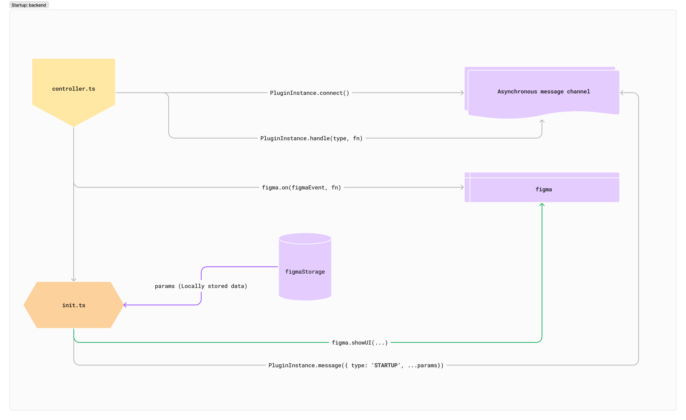

# Current situation

It is important to understand the startup process of the plugin. At the time of writing this logic is a little scattered and should be optimized. See the [section below](./startup-logic.md#desired-situation).

## Entry points

The plugin is bundled using Webpack, where there are two entry points.

### Backend

The file, `controller.ts` is responsible for setting up the initial logic that will allow the plugin to start gathering necessary information in the background. Such as:
* Instantiating the asynchronous messaging channel for the part of code communicating directly with the Figma API (`PluginInstance`)
* Registering all the allowed event names and respective handlers
* Sets listeners to Figma `on` events such as:
   * ['close'](https://www.figma.com/plugin-docs/api/properties/figma-on/#close)
   * ['selectionchange'](https://www.figma.com/plugin-docs/api/properties/figma-on/#selectionchange)
   * ['documentchange'](https://www.figma.com/plugin-docs/api/properties/figma-on/#documentchange)
* Registers the ability for the plugin to be compatible in Dev Mode ([Read more here](https://www.figma.com/plugin-docs/api/figma-codegen/))
* Renders the UI ([Read more here](https://www.figma.com/plugin-docs/api/properties/figma-showui/)) with all the required information gathered from local storage (i.e. license keys, active themes, etc.)

### Frontend

Once the precursing information has been acquired, `index.tsx` is in charge of displaying the actual plugin view. Its responsibilities include:
* Initializing our tracking tools: Mixpanel and Sentry
* Instantiating the asynchronous messaging channel for the part of code communicating with our 'backend' (`ReactInstance`)
* Registering the following events and handlers:
   * `GET_THEME_INFO`: to know the last active theme of the user
   * `STARTUP`: finds the container in the document to render the root of the React application. Wrapped with providers to allow Sentry error tracking, Redux state handling and tooltips

At this point, the `AppContainer` component now has access to all the necessary information and handlers for the user to interact with it.

# Desired situation
1. Split the logic into two parts: the plugin side and the client side
2. Get all the locally stored data and user information and send it to the client as the base starting point for the UI
3. Determine the license validity, get the feature flags, and fetch the remote data in one go using the information from step 2
4. Send back any updated information from the plugin side to the client
